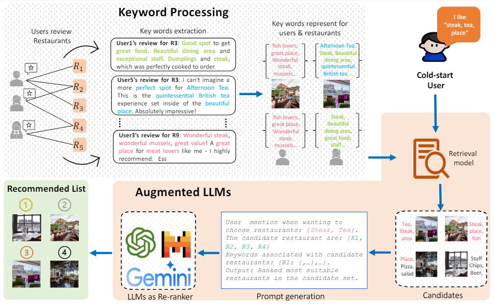

# KALM4Rec
## Keyword-driven Retrieval-Augmented Large Language Models for Cold-start User Recommendations 
<p align="center">

</p>
Recent advancements in Large Language Models (LLMs) have shown
great potential in enhancing recommender systems. However, the
challenge of accurately recommending restaurants to cold-start
users, who have no historical data, remains a considerable hurdle.
In this paper, we propose a method to address the practical scenario
of cold-start user restaurant recommendation, that requires only a
few input keywords from the users. We investigate the efficacy of
combining retrieval models with LLMs which function as rankers
in recommendation. The process involves an initial stage where
keyword-driven retrieval models are used to obtain restaurant can-
didates. This step mitigates the limitations of LLMs in processing
extensive tokens and reducing the risk of generating misleading in-
formation. Subsequently, we employ various prompting strategies
with LLMs including zero-shot and few-shot, and explore in-context
instruction learning by integrating multiple examples directly into
the LLM prompts. Our evaluation, conducted on a Yelp restaurant
dataset comprising reviews and ratings from seven cities globally,
indicates that our proposed system offers considerable improve-
ments in recommendation quality. Notably, integrating in-context
instructions with LLMs as rankers significantly boosts the recom-
mender system’s performance.

## Dependencies
```
TBD
```
##  Usage

### Stage 1: Keyword extraction and Processing
```
# extract keyword
TBD
```

### Stage 2: Generate candidates: jaccard, MPG, BCR, MF, MVAE.

```
# jaccard
python cmain.py --RetModel jaccard

# MF
python .\retrieval.py --RetModel MF  --export2LLMs --city edinburgh --num_epochs 100 --hidden_dim 256 --lr 0.007

# MVAE
python .\retrieval.py --RetModel MVAE  --export2LLMs --city edinburgh --num_epochs 500 --hidden_dim 128 --lr 0.003

# CBR
python retrieval.py --RetModel CBR --edgeType IUF --genType KNN 

# MPG
python retrieval.py --RetModel MGP --edgeType IUF --genType KNN  


```
#### Args

> `checkKeyword`: check number of keywords then exit
>
> `RetModel`: models.
>
> `genType`: build a KNN model to obtain most similar keyword in case of missing for testing user.
>
>

#### Results for retrieval models:
| Models      | P@20        | R@20          |
| :----:      |    :----:   |    :----:     |
| jaccard     | 0.03        |   0.06        |
| MF          | 0.05        |   0.13        |
| MVAE        | 0.08        |   0.28        |
| CBR         | 0.15        |   0.42        |
| MPG         | 0.15        |   0.42        |

### Stage 3: Recommend by LLMs

## Dataset:
```
TBD
```
